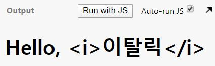
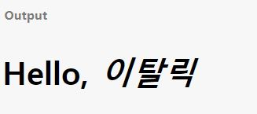

[참고 출처](https://velopert.com/3044)</br>

디렉티브는 이것을 어떻게 해석하라고 알려주는 역할을 한다.</br>
디렉티브는 총 9가지가 있다.</br>
[1. v-text](#v\-text)</br>
[2. v-html](#v\-html)</br>
[3. v-show](#v\-show)</br>
[4. v-if](#v-if)</br>
[5. v-else](#v-else)</br>
[6. v-else-if](#v-else-if)</br>
[7. v-pre](#v-pre)</br>
[8. v-cloak](#v-cloak)</br>
[9. v-once](#v-once)</br>

## v-text
연결된 요소를 텍스트 형태로 렌더링한다. 즉, 안의 내용이 html문 등으로 해석이 되더라도 그것이 의미를 갖지 않는다.</br>
이렇게 텍스트 형태로만 렌더링 할경우 가볍고, XSS공격을 차단할 수 있어서 기본적으로 사용된다.</br>
### 예시
```
  data: {
    name: '<i>이탈릭</i>'
  }
  
  <div id="app">
    <h1>Hello,
      <span v-text="name"></span>
    </h1>
  </div>
```
### 출력 결과
</br></br>

## v-html
무조건 텍스트로 렌더링하는게 좋을 수도 있지만 위처럼 이탤릭체를 적용한다던지 하는것처럼 html문법이 필요할 경우에 사용한다.</br>
주의할 점은 반드시 필요한 곳에만 사용해야 한다는 점이다.</br>
그런데 불필요한 부분은 필터링 한다는 것이 필요한 부분에만 v-html을 사용하라는 것인지
따로 필터링하는 방법이 있는 것인지는 추가적으로 공부를 해야 할 것 같다.</br>
### 예시
```
  data: {
    name: '<i>이탈릭</i>'
  }
  
  <div id="app">
    <h1>Hello,
      <span v-html="name"></span>
    </h1>
  </div>
```
### 출력 결과
</br></br>

## v-show
해당 엘리먼트의 visible속성을 on/off할 수 있다.
### 예시
```
  data: {
    name: '<i>이탈릭</i>'
    visible : ture // 이름이니까 알기 쉽게 visible로
  }
  
  <div id="app">
    <h1>Hello,
      // 실제로 visible이 보일것인지 결정하게되는 이유는 show에 연결된 엘리먼트가 visible이기 때문이다.
      <span v-show="visible" v-html="name"></span>
    </h1>
  </div>
```
### 출력 결과
</br></br>

## v-if

### 예시
```

```
### 출력 결과
</br></br>

## v-else

### 예시
```

```
### 출력 결과
</br></br>

## v-else-if

### 예시
```

```
### 출력 결과
</br></br>

## v-pre

### 예시
```

```
### 출력 결과
</br></br>

## v-cloak

### 예시
```

```
### 출력 결과
</br></br>

## v-once

### 예시
```

```
### 출력 결과
</br></br>
