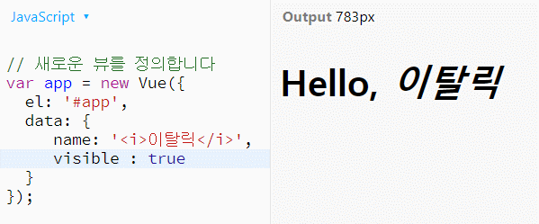

[참고 출처](https://velopert.com/3044)</br>

디렉티브는 이것을 어떻게 해석하라고 알려주는 역할을 한다.</br>
디렉티브는 기본적으로 13가지가 있다.</br>
[1. v-text](#v\-text)</br>
[2. v-html](#v\-html)</br>
[3. v-show](#v\-show)</br>
[4~6. v-if/v-else/v-else-if](#v-if)</br>
[7. v-pre](#v-pre)</br>
[8. v-cloak](#v-cloak)</br>
[9. v-once](#v-once)</br>
[10. v-bind](#v-bind)</br>
[11. v-model](#v-model)</br>
[12. v-for](#v-for)</br>
[13. v-on](#v-on)</br>

## v-text
연결된 요소를 텍스트 형태로 렌더링한다. 즉, 안의 내용이 html문 등으로 해석이 되더라도 그것이 의미를 갖지 않는다.</br>
이렇게 텍스트 형태로만 렌더링 할경우 가볍고, XSS공격을 차단할 수 있어서 기본적으로 사용된다.</br>
### 예시
```
  data: {
    name: '<i>이탈릭</i>'
  }
  
  <div id="app">
    <h1>Hello,
      <span v-text="name"></span>
    </h1>
  </div>
```
### 출력 결과
</br></br>

## v-html
무조건 텍스트로 렌더링하는게 좋을 수도 있지만 위처럼 이탤릭체를 적용한다던지 하는것처럼 html문법이 필요할 경우에 사용한다.</br>
주의할 점은 반드시 필요한 곳에만 사용해야 한다는 점이다.</br>
그런데 불필요한 부분은 필터링 한다는 것이 필요한 부분에만 v-html을 사용하라는 것인지
따로 필터링하는 방법이 있는 것인지는 추가적으로 공부를 해야 할 것 같다.</br>
### 예시
```
  data: {
    name: '<i>이탈릭</i>'
  }
  
  <div id="app">
    <h1>Hello,
      <span v-html="name"></span>
    </h1>
  </div>
```
### 출력 결과
</br></br>

## v-show
해당 엘리먼트의 visible속성을 on/off할 수 있다.</br>
### 예시
```
  data: {
    name: '<i>이탈릭</i>',
    visible : ture // 이름이니까 알기 쉽게 visible로
  }
  
  <div id="app">
    <h1>Hello,
      <!--실제로 visible이 보일것인지 결정하게되는 이유는 show에 연결된 엘리먼트가 visible이기 때문이다.-->
      <!--v-show="vvv"로 설정하면 vvv의 값에 따라 보여질지가 결정된다는 의미-->
      <span v-show="visible" v-html="name"></span>
    </h1>
  </div>
```
### 출력 결과
</br></br>

## v-if / v-else / v-else-if
말 그대로 조건문이다. ~~예시에서는 조건을 충족하면 실행해서 텍스트가 보이게 했는데, 단순히 텍스트가 조건을 충족할 때만 보이게 하는 정도로의 쓰임으로는 사용하지 않을 것 같다고 생각한다... 단순히 나의 추측이다. 공부를 더 계속하면 정확한 용도를 알 수 있겠지?~~ 아니었다.. 그냥 보이거나 보이지 않거나 하는 용도가 맞다고 한다...</br>
재미있는 점은 value값이 정해져있지 않아 비교가 불가능할 경우 아무것도 출력되지 않는 것이 아니라 세 조건문의 문장이 모두 출력되는 현상을 보인다는 것이다. 비교 대상이 없는 경우에 false를 리턴하는것이 아닌건지.. 아니면 JS Bin에서 실행해서 오류를 일으켜서인지는 알 수 없다. 물론 실제로 이런 일은 예외에 속하므로 일어나지 않도록 프로그래밍해야 하니 신경쓰지 않아도 되는 문제일수도 있지만..</br>
추가로 진행한 실험에서 값을 null혹은 '안녕하세요'등 정해진 조건문 규격에 맞지 않는 자료형을 넣었을 경우에는 모두 false를 리턴하는지 else문에 해당하는 문장이 출력되었다. 흥미로운 일이다.</br></br>
추가로 예시에서 비교연산자를 사용했으니 복습하고 넘어가자면, javascript에서에서는 =, ==, ===세가지가 있다.</br>
=는 알던 대로 값을 변수에 할당해주는 연산자이고, ==와 ===는 data type을 비교하느냐 비교하지 않느냐의 차이가 있다.</br>
간단히 ==보다 ===가 =이 하나 더 많으니 더 까다롭게 비교한다고 외우면 될 것 같다..</br>
미래에 또 까먹고 헷갈려할 나를 위해 아래 실행 결과를 첨부한다.</br>
</br>
### 예시
```
  data: {
    value : 7
  }
  
  <div id="app">
    <h1 v-if="value > 5">value 가 5보다 크군요</h1>
    <h1 v-else-if="value === 5">값이 5네요</h1>
    <h1 v-else>value 가 5보다 작아요</h1>
    </h1>
  </div>
```
### 출력 결과
</br></br>

### 추가
건영이에게 확인해본 결과 v-show와 v-if의 차이점은 v-show는 보이지 않더라도 로드는 하는데 v-if는 조건을 만족하지 않는 엘리먼트들은 아예 로드도 하지 않아서 부하가 덜 걸린다고 한다. 그래서 조금만 자주 바뀔경우(엘리먼트를 로드해놓는것이 더 유리한 경우) v-show를 사용하고, 그렇지 않다면 v-if를 사용하는데 보통 v-if를 많이 쓰고 내가 생각해도 그게 나을듯

<details>
  <summary>
v-pre와 cloak, once는 건영이가 하지 말라고 해서 안함 미래의 나야 필요하면 정리해줘</summary>
    <div markdown="1">
      ## v-pre
      ### 예시
      ```

      ```
      ### 출력 결과
      </br></br>

      ## v-cloak

      ### 예시
      ```

      ```
      ### 출력 결과
      </br></br>
    </div>
</details>

## [v-bind](https://velopert.com/3095)
```
{{ value }} 
```
이렇게 내부에 데이터명을 적어 자바스크립트의 변수를 활용할 수 있게 해주는 녀석을 '머스태쉬 태그'라고 한다고 한다.</br>
그러나 머스태쉬 태그는 속성값 내부에 적용할 수가 없다. 이럴 때 사용하는 것이 바로 v-bind이다.</br>
그런데 v-bind는 생략이 가능해서, :데이터명으로만 사용하기도 한다.
```

```
```

```
```

```
세 코드는 같은 의미를 가진다.</br>
또한 지금까지는 디렉티브나 머스태쉬 태그 내부에 데이터명만 넣었지만, 자바스크립트 코드를 그대로 넣어도 된다. 따라서,
```

```
와 같은 사용 또한 가능하다.</br></br>

## [v-for](https://velopert.com/3118)
이름에서도 알 수 있듯, 말 그대로 for문을 사용할 수 있게 해준다.</br>
일반적으로는 게시물 목록, 댓글 목록 표시 등에 사용한다고 한다.</br>
예전에 비슷한 기억이 새록새록 나는 것 같기도 하고..</br>
예시에서 느낀건데, text로 이루어진 데이터는 text 변수에 넣어서 저장을 해야 하는 것 같다? 이것은 따로 더 알아보거나 공부를 해야 할 것 같다..</br>
추가) 건영의 설명으로 그냥 ""으로 감싼 문자열로 저장하는것도 가능하다고 한다. 하지만 일반적으로 사용할 때 여러 원소가 묶여있는 엘리먼트 형태로 정보가 저장되어있고, 그중에 필요한 원소를 가져와서 나타내기 때문에 예시를 저렇게 든 것이라고 한다.</br>
또한 일반적으로 for문을 사용하듯이 사용하는것은 아니고 데이터 전체를 불러올 때 사용한다. 따라서 불러오는 중간에 break를 한다거나, 중간까지의 데이터만 가져온다거나 하는경우는 잘 없고 그렇게는 아마 못한다고 한다..(약간 건피셜같은데 믿어보자)</br>
인덱스값을 가져오고 싶은 경우,
```
<li v-for="(todo, index) in todos">{{index}} {{todo.text}}</li>
```
요렇게 쓰면 된다고 한다.

### 예시
```
  data: {
     todos: [
       { text: '일어나기'},
       { text: '굿플레이스 보기'},
       { text: '밥먹기'},
       { text: '잠자기'}
     ]
  }   

<div id="app">
   <h2>오늘 할 일</h2>
   <ul>
      <li v-for="todo in todos">{{ todo.text }}</li>
   </ul>
</div>
```

### 출력 결과
</br></br>

## [v-model](https://velopert.com/3136)
우리가 지금까지 사용한 것은 단방향 바인딩이다. 즉, 저장된 값을 출력하기만 할 뿐 우리가 적은 값을 보내는 일은 없었다는 것이다.</br>
이를 velopert님은 데이터->뷰라고 표현하셨다. 양방향 바인딩이란 데이터->뷰와 뷰->데이터 모두 실시간으로 가능한 것이라고..한다.</br>
예제가 처음으로 내가 뷰를 배우겠다고 선언했을 때 박건영이 들어주었던것과 같아서 약간 뿌듯하다.ㅎ

### 예시
```
data: {
  value:""
}

<div id="app">
   <h2>{{value}}</h2>
   <input type="text" v-model="value"/>
</div>
```

### 출력 결과
</br></br>

## [v-on](https://velopert.com/3148)
이벤트를 처리할 수 있게 해준다. 어떤 이벤트를 처리할 수 있는지에 대한 설명은, [공식문서](https://kr.vuejs.org/v2/guide/events.html)를 참조하자.</br>
v-on:은 @로 대체하여 사용이 가능하다.
```
<button v-on:click="increment">증가</button>
```
```
<button @click="increment">증가</button>
```
따라서 위의 두 코드는 동일한 의미를 갖는다.</br>
위에서 사용한 increment는 "메소드"이다. 정의하는 방법은 데이터를 선언할 때 처럼 methods:를 이용해 선언하고 내부에 정의할 함수들을 적으면 된다.</br>
```
data: {
    number: 0
},
// app 뷰 인스턴스를 위한 메소드들
methods: {
  // 메소드명: function()
  increment: function() {
    // 인스턴스 내부의 데이터모델에 접근할 때는 this 를 사용한다
    this.number++;
  },
  decrement: function() {
    this.number--;
  }
}
```